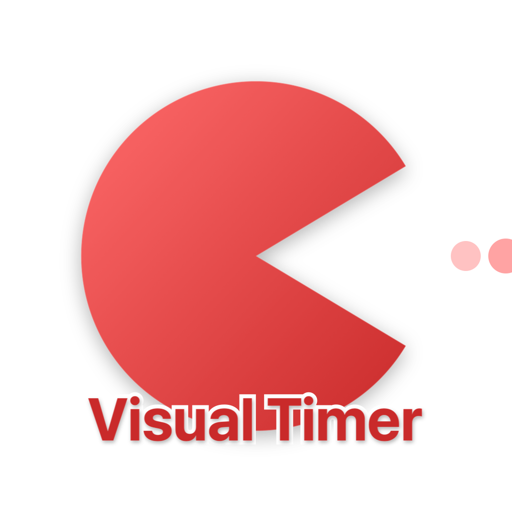
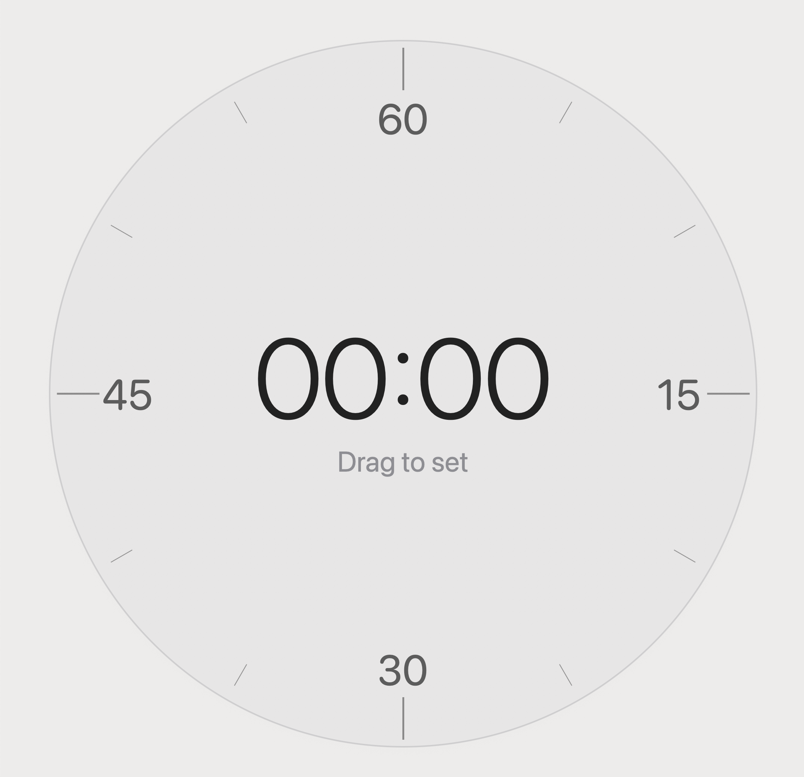

# Visual Timer

  

    
    &nbsp;&nbsp;
    
  

## シンプルで美しいビジュアルタイマー

Visual Timerは、macOS用のミニマルなタイマーアプリです。ドラッグ操作で直感的に時間を設定できます

## 主な機能

- 🎯 **直感的な操作** - 円をドラッグして1〜60分まで設定
- 🔴 **ビジュアルフィードバック** - 赤い円が徐々に減っていく視覚的なカウントダウン
- 🎵 **カスタムアラーム** - タイマー終了時にMP3サウンドを再生
- 🪟 **常に最前面** - 他のウィンドウの上に浮かぶフローティングウィンドウ
- ⬜ **正方形ウィンドウ** - サイズ変更時も常に正方形を維持

## 使い方

1. **時間設定**: タイマーの円周上をドラッグして時間を設定（1分〜60分）
2. **開始**: ドラッグを終えると自動的にタイマーが開始
3. **一時停止/再開**: タイマーをタップして一時停止・再開
4. **リセット**: 実行中にドラッグすると新しい時間に設定

## システム要件

- macOS 14.0以降
- Apple Silicon (M1/M2/M3) または Intel Mac

## インストール

1. `VisualTimer.app`をダウンロード
2. アプリケーションフォルダにドラッグ
3. 初回起動時は右クリックして「開く」を選択

## 特徴

- ミニマルでクリーンなデザイン
- リソース使用量が少ない軽量アプリ
- 集中力を維持するための視覚的なタイマー表示
- ポモドーロ・テクニックに最適

---

**Version**: 1.0
**Copyright**: © 2024 keisuke-na
**License**: MIT